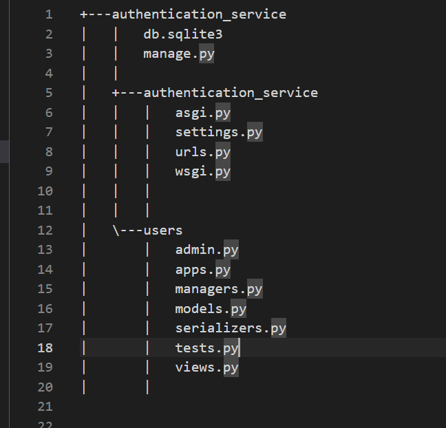
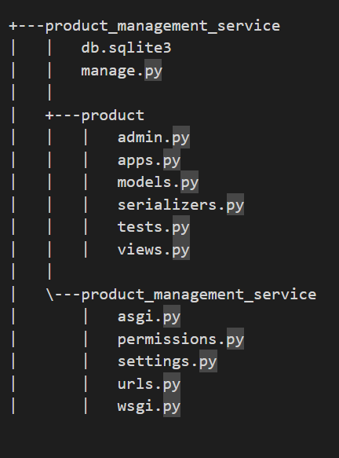
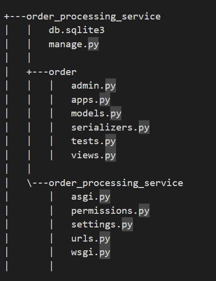

# Microservices Architecture Overview
This repository contains three microservices developed for a simple e-commerce application. Each microservice is responsible for specific functionalities and interacts with each other as part of the overall system.

### 1. Authentication Microservice
The Authentication Microservice is responsible for user authentication using JWT (JSON Web Tokens). It provides endpoints for user registration, login, and authentication. Upon successful authentication, it generates JWT tokens for users, which are used to authorize access to protected endpoints in other microservices.

### 2. Product Microservice
The Product Microservice handles CRUD (Create, Read, Update, Delete) operations related only to products. It manages product information stored in the database, including tables for products, categories, and other related entities. Authorization checks for accessing product-related endpoints are performed based on JWT tokens generated by the Authentication Microservice.

### 3. Order Microservice
The Order Microservice manages CRUD operations related only to orders. It handles order creation, retrieval, update, and deletion, along with managing the order history. Similar to the Product Microservice, authorization checks for accessing order-related endpoints are performed based on JWT tokens generated by the Authentication Microservice.

## Authorization and Authentication
Both the Product and Order Microservices depend on the Authentication Microservice for user authentication and authorization. The Authentication Microservice generates JWT tokens upon successful authentication, which are then used by the Product and Order Microservices to authorize access to protected endpoints. This ensures that only authenticated users with valid JWT tokens can perform CRUD operations on products and orders.

